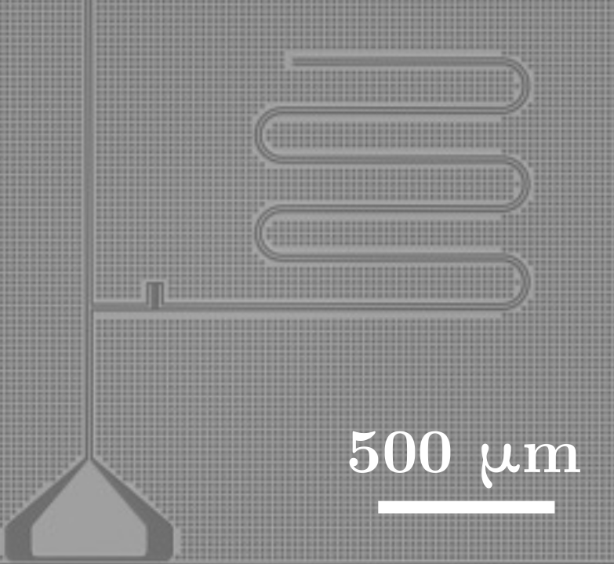
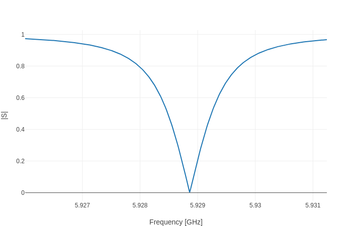
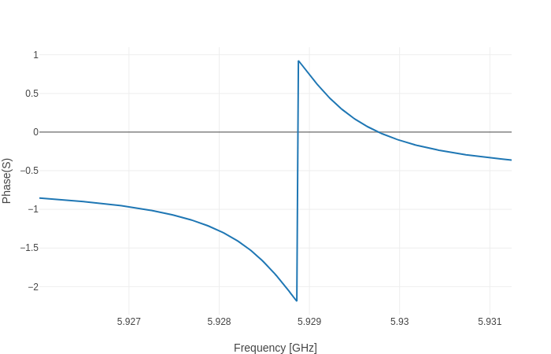

# AdmittanceModels.jl

[paper-url]: https://arxiv.org/abs/1810.11510
[travis-img]: https://travis-ci.com/rigetti/AdmittanceModels.jl.svg?branch=master
[travis-url]: https://travis-ci.com/rigetti/AdmittanceModels.jl
[codecov-img]: https://codecov.io/gh/rigetti/AdmittanceModels.jl/branch/master/graph/badge.svg
[codecov-url]: https://codecov.io/gh/rigetti/AdmittanceModels.jl

[![][travis-img]][travis-url]
[![][codecov-img]][codecov-url]

AdmittanceModels.jl is a package for creating and manipulating linear input-output models of the form `YΦ = Px`, `y = QᵀΦ` where `x` are the inputs and `y` are the outputs. One example of such a model is a Positive Second Order model, defined in [[1]][paper-url]. Such models can capture the equations of motion of a circuit consisting of inductors, capacitors, and resistors.

The scripts in `paper` were used to generate the figures in [[1]][paper-url].

If you use this package in a publication, please cite our paper:

```
@article{ScheerBlock2018,
    author = {Michael G. Scheer and Maxwell B. Block},
    title = "{Computational modeling of decay and hybridization in superconducting circuits}",
    year = "2018",
    month = "Oct",
    note = {arXiv:1810.11510},
    archivePrefix = {arXiv},
    eprint = {1810.11510},
    primaryClass = {quant-ph},
}
```

[1] [Computational modeling of decay and hybridization in superconducting circuits][paper-url]

## Installation

Clone the repository from GitHub and install Julia 1.1. No build is required beyond the default Julia compilation.

## Example usage: the circuit in Appendix A of [[1]][paper-url]

Construct the circuit in Appendix A, with arbitrarily chosen values.
```julia
using AdmittanceModels
vertices = collect(0:4)
circuit = Circuit(vertices)
set_capacitance!(circuit, 0, 1, 10.0)
set_capacitance!(circuit, 1, 2, 4.0)
set_capacitance!(circuit, 0, 3, 4.0)
set_capacitance!(circuit, 2, 3, 5.0)
set_capacitance!(circuit, 3, 4, 5.0)
set_inv_inductance!(circuit, 1, 2, 3.5)
set_inv_inductance!(circuit, 0, 3, 4.5)
```

Use the spanning tree in Appendix A to find a Positive Second Order model.
```julia
root = 0
edges = [(1, 0),
         (3, 0),
         (4, 0),
         (2, 1)]
tree = SpanningTree(root, edges)
PSOModel(circuit, [(4, 0)], ["port"], tree)
```

The tree is optional because a change of spanning tree is simply an invertible change of coordinates.
```julia
PSOModel(circuit, [(4, 0)], ["port"])
```

## Example usage: a λ/4 transmission line resonator capacitively coupled to a transmission line

The model we will analyze is similar the device shown below, from [Manufacturing low dissipation superconducting quantum processors](https://arxiv.org/abs/1901.08042).



Create `CircuitComponent` objects for the model.
```julia
using AdmittanceModels
ν = 1.2e8 # propagation_speed
Z0 = 50.0 # characteristic_impedance
δ = 100e-6 # discretization length

resonator = TransmissionLine(["coupler_0", "short"], ν, Z0, 5e-3, δ=δ)
tline = TransmissionLine(["in", "coupler_1", "out"], ν, Z0, 2e-3, locations=[1e-3], δ=δ)
coupler = SeriesComponent("coupler_0", "coupler_1", 0, 0, 10e-15)
components = [resonator, tline, coupler]
```

Use `PSOModel` objects to compute the frequency and decay rate of quarter wave resonator mode. Include resistors at the ports in order to get the correct decay rate.
```julia
resistors = [ParallelComponent(name, 0, 1/Z0, 0) for name in ["in", "out"]]
pso = connect(PSOModel.([components; resistors]))
pso = short_ports(pso, "short")
λs, _ = lossy_modes_dense(pso, min_freq=3e9, max_freq=7e9)
freq = imag(λs[1])/(2π)
decay = -2*real(λs[1])/(2π)
```

Compute the transmission scattering parameters `Blackbox`. This uses a closed form representation of the transmission lines.
```julia
ω = collect(range(freq - 2 * decay, stop=freq + 2 * decay, length=300)) * 2π
bbox = connect(Blackbox.(Ref(ω), components))
bbox = short_ports(bbox, "short")
bbox = open_ports_except(bbox, ["in", "out"])
S = [x[1,2] for x in scattering_matrices(bbox, [Z0, Z0])]
```

Plot the magnitude of the scattering parameters.
```julia
using PlotlyJS
plot(scatter(x=ω/(2π*1e9), y=abs.(S)), Layout(xaxis_title="Frequency [GHz]", yaxis_title="|S|"))
```



Plot the phase of the scattering parameters.
```julia
plot(scatter(x=ω/(2π*1e9), y=angle.(S)), Layout(xaxis_title="Frequency [GHz]", yaxis_title="Phase(S)"))
```



## Using with ANSYS Q3D Extractor

Plain text files containing RLGC parameters exported by ANSYS® Q3D Extractor®
software can be used to construct a `Circuit` object via `Circuit(file_path)`.
Currently only capacitance matrices are supported.

ANSYS and Q3D Extractor are registered trademarks of ANSYS, Inc. or its
subsidiaries in the United States or other countries.
